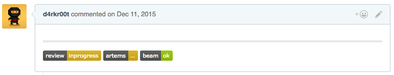
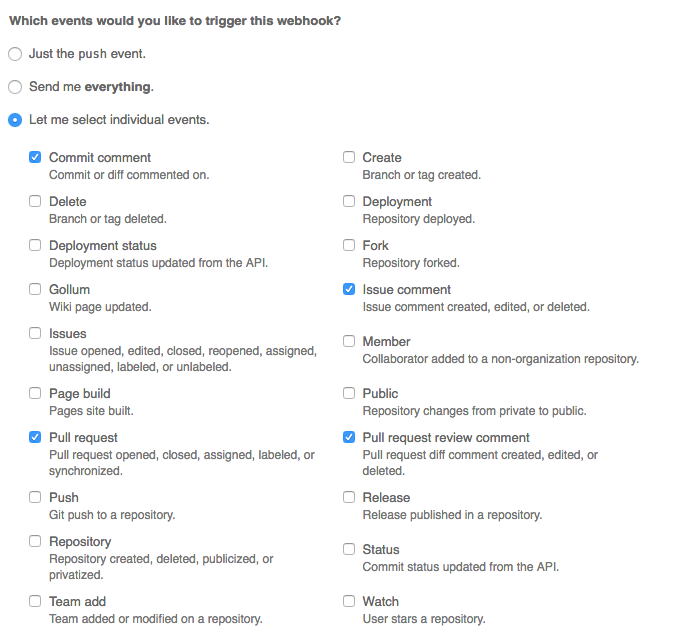
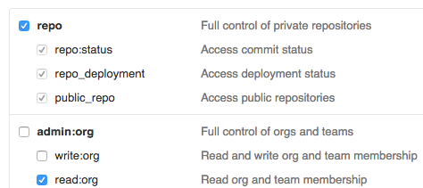

<div align="center">
  
</div>
<p align="center"><big>
Automaticaly choose reviewers for pull requests.
</big></p>
<p align="center">
  <a href="http://opensource.org/licenses/MIT">
    
  </a>

  <a href="https://github.com/devexp-org/devexp/issues">
    
  </a>

  <a href="https://travis-ci.org/devexp-org/devexp">
    
  </a>

  <a href="https://coveralls.io/github/devexp-org/devexp">
    
  </a>
</p>

## Table of Content
* [How Does It Look Like](#how-does-it-look-like)
* [Getting Started](#getting-started)
* [Configuration](#configuration)
* [Docs](#docs)

## How Does It Look Like



## Getting Started

* Setup mongodb and node >= 0.12
* Clone the repo
* ```npm i --production``` inside
* Setup configuration (Read more about configuration here)
* Go To
  * your project on GitHub > Settings > Webhooks & services > Add Webhook or
  * your organization on GitHub > Settings > Webhooks > Add Webhook
  * 
* Payload URL — ```http://yourhost/github/webhook```
* Run ```NODE_ENV=production npm start``` or ```NODE_ENV=production forever start start.js```
* Open — ```http://yourhost/``` and check if everything is up and running

## Configuration

You'll get default configuration, but at least you need to set up GitHub auth token and Mongodb.

In config/default.json you can find section about mongodb, change host and db name if needed.
And configuration for github, change host if you use in-house github installation:

```json
"mongoose": {
  "path": "./core/services/mongoose",
  "options": {
    "host": "mongodb://localhost/devexp"
  },
  ...
},
...
"github": {
  "path": "./core/services/github",
  "options": {
    "host": "api.github.com",
    ...
  },
  "dependencies": []
},
```

Also you need to change review badges url in config/default.json:

```json
"review-badges": {
  "path": "./core/services/review-badges",
  "options": {
    "url": "http://localhost:8080/badges/",
    "style": "flat"
  },
  "dependencies": [ ... ]
},
```

In file config/secret.json you can find configuration for github api tokens:

```json
"github": {
  "options": {
    "authenticate": {
      "type": "oauth",
      "token": "your_auth_token"
    }
  }
}
```

Choose these scopes for access token:



File config/secret.json supposted to be used for tokens, passwords etc.

## Docs

* [Plugins References](docs/plugins.md)
* ```TODO: more docs```
